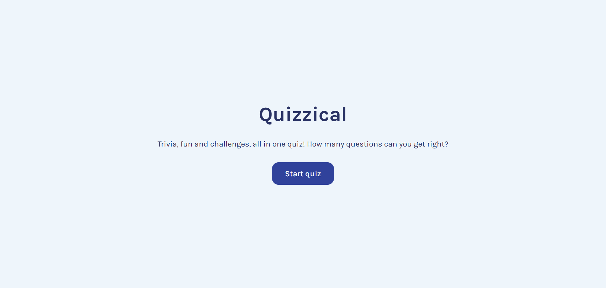
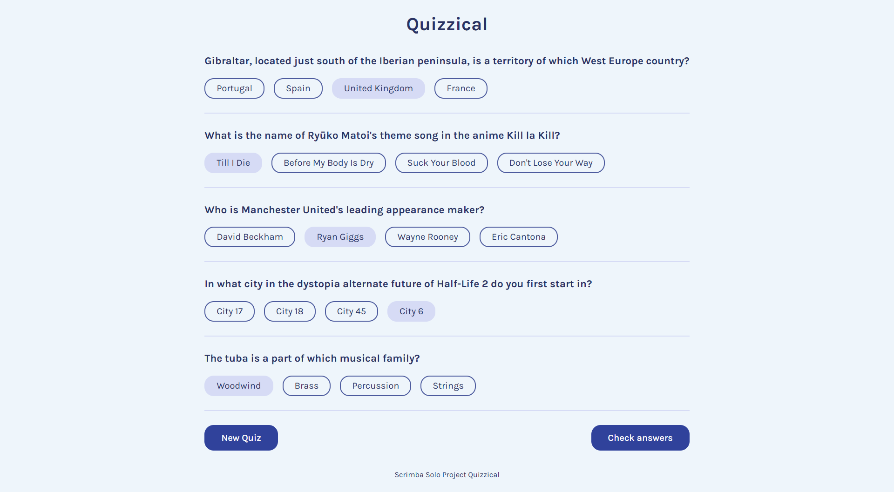
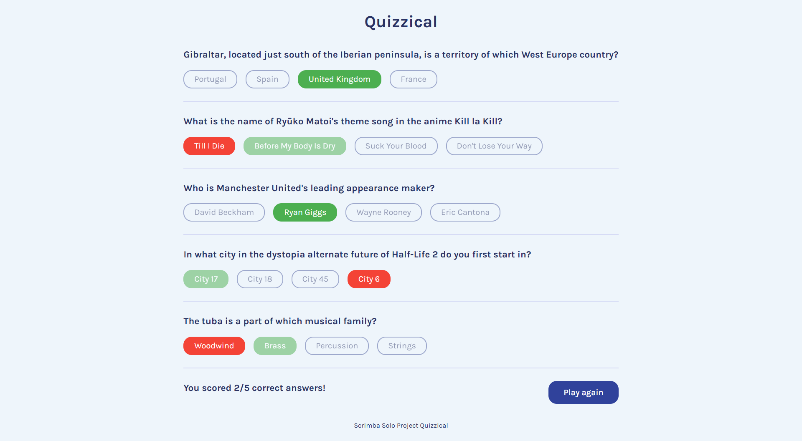

# ❓ Quizzical - Trivia Quiz Web Application

A multiple-choice trivia quiz application built with `React` and `Vite` that fetches multiple-choice questions from the `Open Trivia Database API`. Users can select answers, check their score, and play multiple rounds without repeating questions. The app includes shuffled answer choices, score tracking, loading and error handling, automatic session token management, automated testing with `Vitest` and `React Testing Library`, and continuous integration using `GitHub Actions`.

## 🌐 Live Demo
🔗 View app: https://trivia-quiz-rushdina.vercel.app/ 

<!---->



## 🛠️ Technologies Used

- **Frontend:** `React`, `Vite`, `JavaScript (ES6+)`, `HTML`, `CSS`
- **External APIs:** [Open Trivia Database API](https://opentdb.com/api_config.php) – Retrieve questions data
- **External Libraries:**
  - [nanoid](https://www.npmjs.com/package/nanoid) – Generates unique IDs for questions and answers
  - [he](https://www.npmjs.com/package/he#hedecodehtml-options) (HTML Entities) – Decodes HTML entities from API responses (e.g: `&quot;` → `"`)
- **Testing:** `Vitest`, `React Testing Library`, `jest-dom`
- **CI:** `GitHub Actions`

## ✨ Features

- Fetches random multiple-choice mixed-category questions from `Open Trivia Database API`
- Prevents duplicate questions using session tokens and handles token expiration automatically
- Randomises answer options using the Fisher–Yates shuffle algorithm
- Decodes HTML entities in questions and answers using the `he` package
- Allows users to select answers, submit responses, and view their final score
- Highlights correct and incorrect selections after submission
- Supports generating a new quiz through the "Play Again" functionality
- Includes loading indicators, retry functionality, and error handling for failed API requests

## ⚡ How to Run Locally

### Installation

Prerequisites: `Node.js`, `npm`

1. **Clone the repository & navigate to project directory**

```bash
git clone https://github.com/<username>/<repository>.git
cd <repository>
```

2. **Install dependencies**

```bash
npm install
```

3. **Run development server**

```bash
npm run dev
```

4. Open the **Localhost URL** (`http://localhost:5173`) shown in your terminal.
   
### Running Tests
- Run the test suite:
```bash
npm test
```
- Run tests in CI mode:
```bash
npm run test:ci
```

## 🔄 Application Workflow

1. Users start the quiz from the landing page.
2. The application requests a session token from the `Open Trivia Database API`.
3. Five multiple-choice questions are retrieved and transformed into the application's internal quiz format.
4. Users answer all quiz questions and submit their responses.
5. The application evaluates the responses and displays the final score.
6. Users can choose to play again and generate a new set of questions.

## 🧠 Challenges Encountered

- **API Tokens & Rate Limits**: Empty/expired tokens and rapid requests caused errors (`429`).
  - Solution: Automatically fetched a new token, reset after all questions are used, and added a 1-second delay between requests.
- **State Management**: Avoided unnecessary re-renders and stale values with multiple state variables.
  - Solution: Structured `useEffect` with proper dependencies and passed token explicitly to async fetches.
- **Shuffling and Formatting Questions**: API responses needed consistent formatting, and answers had to be shuffled.
  - Solution: Created a reusable function with `Fisher-Yates shuffle` to format questions.
- **Answer Validation**: Verify selected answers against correct ones.
  - Solution: Iterates through all questions, finds the selected answer object, and checks its `isCorrect` property to calculate the score.
- **Refactor**: `Questions.jsx` handled too many responsibilities. Hard to maintain.
  - Solution: Split logic into `api`, `utils`, and reusable UI components.

## 📚 What I Learned

- Managing multiple React states with React Hooks.
- Integrating third-party APIs using asynchronous JavaScript.
- Transforming and validating external data before rendering.
- Implementing automated tests at multiple levels.
- Mocking dependencies and API responses during testing.
- Setting up continuous integration workflows using GitHub Actions.
- Structuring React applications using reusable components and separation of concerns.

## 💡 Future Improvements

- Difficulty and category filters
- Timer mode

## 🙌 Acknowledgements

- Solo project from [Scrimba Frontend Developer Career Path](https://scrimba.com/frontend-path-c0j)
- Design reference from [Figma by Scrimba](https://www.figma.com/design/E9S5iPcm10f0RIHK8mCqKL/Quizzical-App?node-id=8-448&t=1PTwhDp6TAwDlrhX-0)
